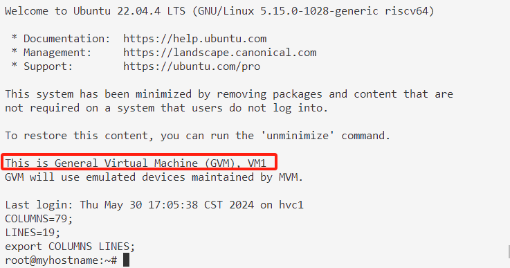
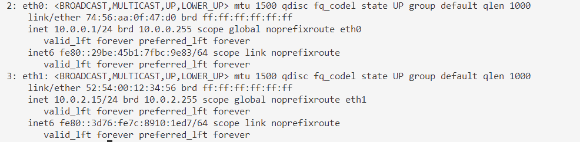
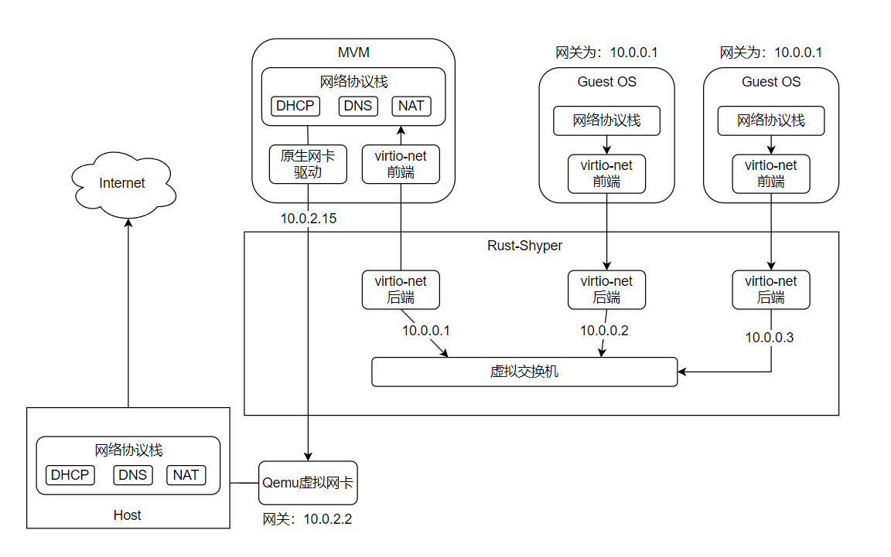

# 面向 RISCV64 的 Rust-Shyper 使用文档

本文档主要用来说明如何在QEMU平台上启动riscv64版本的Rust-Shyper，并在其上运行多个VM。

## 软件依赖

在运行Rust-Shyper之前，需要安装如下的软件依赖：

* Rust
* riscv64-linux-gnu-gcc 交叉编译工具链
    ```shell
    sudo apt install gcc-riscv64-linux-gnu
    ```
* cargo-binutils(可选)
* qemu-system-riscv64 8.2.0 及以上版本（低版本不支持riscv的虚拟化扩展）

## MVM的配置

### 基本介绍

MVM是用于对其他虚拟机进行管理的管理VM，运行Linux，可以通过内核模块和用户态命令行工具（CLI）与Rust-Shyper通信，以此完成VM管理的任务。

对于MVM，本项目使用的Linux镜像在 `image/Image_5.15.100-riscv-starfive`。此镜像是基于Ubuntu 22.04 Starfive发行版Preinstalled镜像提取的内核镜像，具有较为完整的功能（开启了大部分常用的内核选项）和兼容性。

> 要了解更多关于Ubuntu对RISC-V的支持，参见[https://ubuntu.com/download/risc-v](https://ubuntu.com/download/risc-v)

本项目使用的Linux rootfs是以Ubuntu base image为基础，通过在riscv64平台Linux（如Qemu + riscv64裸Linux）上chroot进入镜像经过一系列安装配置来构建的。如果对这些操作不熟悉的话，可以使用现成的镜像：

* https://ubuntu.com/download/risc-vhttps://bhpan.buaa.edu.cn/link/AAF36D01FF739449A19B7D28CC5639F555
* 文件名：vm0_ubuntu_gvm.img
* 有效期限：2040-01-01 20:11
* 提取码：2Axz

此镜像的用户名和密码均为root。

> Ubuntu base image是一个很小的Linux rootfs。与自行构建的rootfs有所不同，Ubuntu base image支持apt安装程序，并自带基本的gnu命令行工具，可供用户从零构建包含完整软件包rootfs。可参考[Ubuntu Base官方](https://www.cdimage.ubuntu.com/ubuntu-base/releases/jammy/release/)

### MVM的配置信息

对MVM的配置主要看 `src/config/qemu_riscv64_def.rs`.

```rs
pub fn mvm_config_init() {
    // Set the configuration name for VM0
    vm_cfg_set_config_name("qemu-default");

    // vm0 emu
    let emu_dev_config = vec![
        // Defines the start address and length of the PLIC device
        VmEmulatedDeviceConfig {
            name: String::from("plic"),
            base_ipa: 0xc000000,
            length: 0x600000,
            irq_id: 0,
            cfg_list: Vec::new(),
            emu_type: EmuDeviceType::EmuDeviceTPlic,
            mediated: false,
        },
        // hvc2
        VmEmulatedDeviceConfig {
            name: String::from("virtio_console@40001000"),
            base_ipa: 0x4000_1000,
            length: 0x1000,
            irq_id: 46,
            cfg_list: vec![1, 0x40001000],
            emu_type: EmuDeviceType::EmuDeviceTVirtioConsole,
            mediated: false,
        },
        // hvc1
        VmEmulatedDeviceConfig {
            name: String::from("virtio_console@40002000"),
            base_ipa: 0x4000_2000,
            length: 0x1000,
            irq_id: 47,
            cfg_list: vec![2, 0x4000_2000], // Address of the peer vm and the peer virtio-console
            emu_type: EmuDeviceType::EmuDeviceTVirtioConsole,
            mediated: false,
        },
        // virtual eth0
        VmEmulatedDeviceConfig {
            name: String::from("virtio_net@40003000"),
            base_ipa: 0x40003000,
            length: 0x1000,
            irq_id: 48,
            cfg_list: vec![0x74, 0x56, 0xaa, 0x0f, 0x47, 0xd0],
            emu_type: EmuDeviceType::EmuDeviceTVirtioNet,
            mediated: false,
        },
        VmEmulatedDeviceConfig {
            name: String::from("shyper"),
            base_ipa: 0,
            length: 0,
            irq_id: HVC_IRQ,
            cfg_list: Vec::new(),
            emu_type: EmuDeviceType::EmuDeviceTShyper,
            mediated: false,
        }
    ];

    // vm0 passthrough
    let pt_dev_config: VmPassthroughDeviceConfig = VmPassthroughDeviceConfig {
        regions: vec![
            // pass-through virtio blk
            PassthroughRegion { ipa: 0x10001000, pa: 0x10001000, length: 0x1000, dev_property: true },
            PassthroughRegion { ipa: 0x10002000, pa: 0x10002000, length: 0x1000, dev_property: true },
            PassthroughRegion { ipa: 0x10003000, pa: 0x10003000, length: 0x1000, dev_property: true },
            PassthroughRegion { ipa: 0x10004000, pa: 0x10004000, length: 0x1000, dev_property: true },
            PassthroughRegion { ipa: 0x10005000, pa: 0x10005000, length: 0x1000, dev_property: true },
            PassthroughRegion { ipa: 0x10006000, pa: 0x10006000, length: 0x1000, dev_property: true },
            PassthroughRegion { ipa: 0x10007000, pa: 0x10007000, length: 0x1000, dev_property: true },
            PassthroughRegion { ipa: 0x10008000, pa: 0x10008000, length: 0x1000, dev_property: true },
            // Serial Device
            PassthroughRegion { ipa: 0x10000000, pa: 0x10000000, length: 0x1000, dev_property: true },
            // RTC
            PassthroughRegion { ipa: 0x101000, pa: 0x101000, length: 0x1000, dev_property: true },
        ],
        irqs: vec![1, 2, 3, 4, 5, 6, 7, 8, 9, 10, 11,],
        streams_ids: vec![]
    };

    // vm0 vm_region
    let vm_region = vec![
        VmRegion {
            ipa_start: 0x90000000,
            length: 0x100000000,
        }
    ];

    // vm0 config
    let mvm_config_entry = VmConfigEntry {
        id: 0,
        name: String::from("supervisor"),
        os_type: VmType::VmTOs,
        cmdline: String::from("earlycon=sbi console=ttyS0 root=/dev/vda rw audit=0 default_hugepagesz=2M hugepagesz=2M hugepages=10\0"),
        image: VmImageConfig {
            kernel_img_name: Some("Image"),
            kernel_load_ipa: 0x90000000,
            kernel_entry_point: 0x90000000,
            device_tree_load_ipa: 0x180000000,
            ramdisk_load_ipa: 0,
            mediated_block_index: None,
        },
        cpu: VmCpuConfig {
            num: 1,
            allocate_bitmap: 0b0001,
            master: Some(0),
        },
        memory: VmMemoryConfig {
            region: vm_region,
        },
        vm_emu_dev_confg: VmEmulatedDeviceConfigList { emu_dev_list: emu_dev_config },
        vm_pt_dev_confg: pt_dev_config,
        vm_dtb_devs: VMDtbDevConfigList::default(),
        ..Default::default()
    };
    let _ = vm_cfg_add_vm_entry(mvm_config_entry);
}
```

该文件配置了MVM的模拟设备、直通设备、中间物理内存（IPA）起始地址与大小、内核启动参数、内核加载地址、cpu数目等等。这部分并非完全固定，可以根据自己的需求在一定范围内做动态的更改。

## Rust-Shyper的启动

使用如下命令编译RISC-V版本的Rust-Shyper：

```shell
ARCH=riscv64 make
```

使用如下命令运行：

```shell
ARCH=riscv64 make run
```

## GVM的启动与配置

GVM的启动需要依赖内核模块（`tools/shyper_riscv64.ko`）和CLI程序（由`cli/`编译得到）。

登录到MVM中，按照如下步骤，就可以配置并启动客户虚拟机。

**Step 0**:

在RISC-V64环境下，编译CLI程序，得到 `shyper` 可执行文件。

> 可参考 https://ubuntu.com/download/risc-v 配置一个只运行Linux的RISC-V虚拟机，然后在这个环境下编译RISC-V的依赖项。

**Step 1**: 安装内核模块

```shell
insmod shyper_riscv64.ko
```

**Step 2**: 启动shyper-cli守护进程

```shell
chmod +x shyper
./shyper system daemon [mediated-cfg.json] &
```

`mediated-cfg.json`（本目录下的 `shypercli-config.json` 就是一个参考）用于配置其他 guest VM 的 virtio 中介磁盘，示例如下：

```json
{
    "mediated": [
        "/root/vm0_ubuntu.img", // 此处配置第1个GVM的中介磁盘
        "/root/vm0_ubuntu_2.img", // 此处配置第2个VM的中介磁盘
        "/root/vm0_busybox.img" // 此处配置第3个VM的中介磁盘
    ]
}
```

其中，列表每一项既可以写分区名（如`/dev/sda1`），又可以写磁盘镜像名。

**Step 3**: 通过配置文件来配置GVM：

```shell
./shyper vm config <vm-config.json>
```

本目录下（`./vm1_config_riscv.json`）提供了配置文件的示例：

```json
{
    "name": "guest-os-1",
    "type": "VM_T_LINUX",
    // 配置内核启动参数
    "cmdline": "earlycon=sbi console=hvc1 root=/dev/vda rw audit=0",
    "image": {
        // 配置内核镜像的位置
        "kernel_filename": "Image",
        "kernel_load_ipa": "0x80200000",
        "kernel_entry_point": "0x80200000",
        "device_tree_filename": "",
        "device_tree_load_ipa": "0xa0000000",
        "ramdisk_filename": "initrd.gz",
        "ramdisk_load_ipa": "0"
    },
    "memory": {
        // 内存区域配置
        "num": 1,
        "region": [
            {
                "ipa_start": "0x80000000",
                "length": "0x40000000"
            }
        ]
    },
    "cpu": {
        // 配置CPU分配。allocate_bitmap表示给GVM分配哪些物理核心
        // MVM独占0核，其他核允许GVM之间共享。如GVM1和GVM2可以共享1、2、3核
        "num": 3,
        "allocate_bitmap": "0b1110",
        // 主核心号，是上面的allocate_bitmap中的其中一个
        "master" : 1
    },
    // 模拟设备配置，不用管，已经配置好了
    "emulated_device" : {
        "num": 4,
        "emulated_device_list": [
            {
                "name": "plic@c000000",
                "base_ipa": "0xc000000",
                "length": "0x600000",
                "irq_id": 1,
                "cfg_num": 2,
                "cfg_list": [
                    0,
                    0
                ],
                "type": "EMU_DEVICE_T_PLIC"
            },
            {
                "name": "virtio_blk@10001000",
                "base_ipa": "0x10001000",
                "length": "0x1000",
                "irq_id": 19,
                "cfg_num": 2,
                "cfg_list": [
                    0,
                    8192000
                ],
                "type": "EMU_DEVICE_T_VIRTIO_BLK_MEDIATED"
            },
            {
                "name": "virtio_net@50000000",
                "base_ipa": "0x50000000",
                "length": "0x1000",
                "irq_id": 20,
                "cfg_num": 6,
                "cfg_list": [
                    "0x74",
                    "0x56",
                    "0xaa",
                    "0x0f",
                    "0x47",
                    "0xd1"
                ],
                "type": "EMU_DEVICE_T_VIRTIO_NET"
            },
            {
                "name": "virtio_console@40001000",
                "base_ipa": "0x40001000",
                "length": "0x1000",
                "irq_id": 21,
                "cfg_num": 2,
                "cfg_list": [
                    "0",
                    "0x40001000"
                ],
                "type": "EMU_DEVICE_T_VIRTIO_CONSOLE"
            }
        ]
    },
    // 直通设备配置，不用管，已经配置好了
    "passthrough_device": {
        "passthrough_device_list": [
        ]
    },
    // 直通设备的设备树配置，不用管，已经配置好了
    "dtb_device" : {
        "num": 0,
        "dtb_device_list": [
	    ]
    }
}
```

**Step 4**: 启动客户虚拟机

```shell
./shyper vm boot <VMID>
```

<VMID>按照启动的顺序排序。MVM的VMID为0，第一个启动的GVM的VMID为1。可以通过`./shyper vm list` 查看当前配置的各个VM的信息。

**Step 5**: 与客户虚拟机交互

此时先从外部ssh连接到MVM：

```shell
ssh root@localhost -p 5555
```

然后通过minicom连接hvc1，监控GVM的串口输出：

```shell
minicom -D /dev/hvc1 -b 115200
```

这样就可以与GVM交互了：



> 本项目镜像中带有的GVM镜像 `vm0_ubuntu.img`，其用户名为root，密码为vm1

## 网络通信

MVM上默认绑定了两块网卡：eth0和eth1，均为virtio网卡。其中第一块是虚拟网卡，第二块是来自qemu的直通物理网卡。



MVM绑定的网卡地址为10.0.0.1(eth0，作为GVM的网关)和10.0.2.15(eth1, 网关为10.0.2.2，通过该网关访问外部网络)。

对于GVM，VM1的网卡地址为10.0.0.2，其他VM IP地址最后一位数依次递增。

MVM可以通过10.0.0.0/24网段与GVM通信，并通过10.0.2.2网关与外网通信。具体的网络拓扑图如下图所示：


